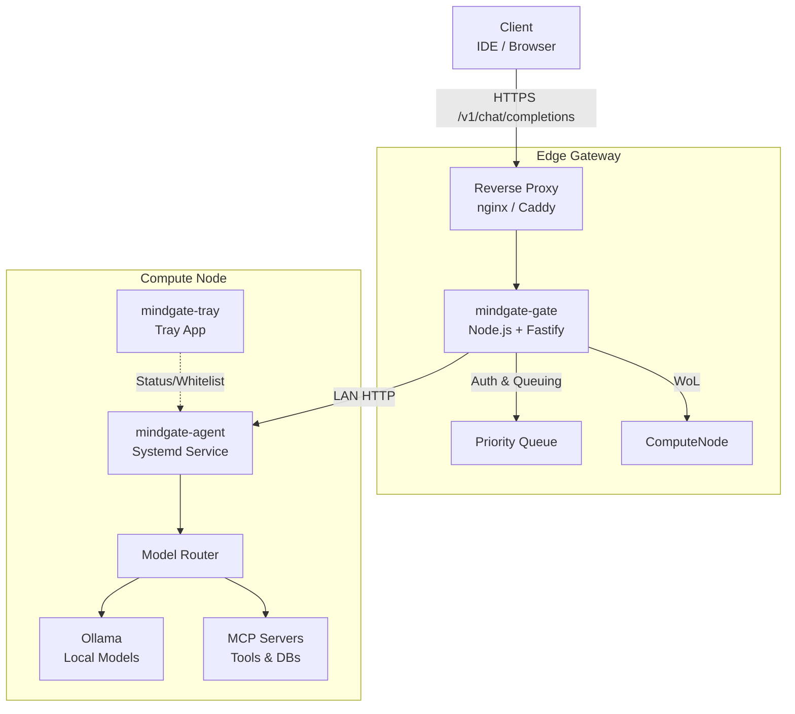

<div align="center">
  <h1>🧠 MindGate</h1>
  <p><strong>A secure, self-hosted Local AI Gateway & Orchestrator</strong></p>
</div>

## 📌 Overview

**MindGate** is a private, on-premise AI infrastructure management system. It securely exposes a fully **OpenAI-compatible API** to your local network or external tools while handling authentication, model routing, request queuing, and Wake-on-LAN (WoL) triggers.

It consists of a lightweight edge gateway (e.g., Raspberry Pi) and a dedicated high-performance compute node, communicating seamlessly to provide on-demand access to local LLMs (via Ollama) and MCP tools. MindGate integrates instantly with clients like Cursor, Continue.dev, and Open WebUI.

---

## 🏗️ Architecture

MindGate employs a distributed, two-tier architecture:

1. **Edge Gateway (`mindgate-gate`)**: Runs 24/7 on a low-power device (e.g., Raspberry Pi). Handles HTTPS termination, API key validation, request queuing, and routing traffic to appropriate compute nodes (waking them up only when necessary).
2. **Compute Nodes (`mindgate-agent` & `mindgate-tray`)**: One or more high-performance machines running local models via Ollama. Each features a system tray app for process whitelisting and status monitoring.



---

## ✨ Features

- **OpenAI-Compatible API**: Works out-of-the-box with any standard OpenAI client by simply changing the base URL.
- **Priority-Based Queuing**: Requests are assigned priority levels (1-5). Critical requests bypass the queue, while low-priority background tasks wait.
- **Smart Wake-on-LAN (WoL)**: The heavy compute node stays asleep to save power. The edge gateway wakes it up only when high-priority tasks (Level 3+) arrive.
- **Semantic Model Profiles**: Define abstraction layers for models (`flash`, `reasoning`, `coding-fast`, `extreme`), decoupling clients from specific model names.
- **Pipeline Mode**: Route a single request through multiple models (e.g., `reasoning` for logic, `flash` for formatting).
- **System Tray Management**: Easily toggle "PC in use" status and manage process whitelists directly from the Windows/Linux tray.

---

## 🚀 Getting Started

MindGate requires setting up both the Edge Gateway and the Compute Node. 

### 1. Edge Gateway Deployment (Raspberry Pi/Linux)
The gateway runs natively on Node.js using Fastify.
```bash
git clone https://github.com/your-org/mindgate.git
cd mindgate/gate
npm install
npm start
```
*(For production, we recommend running this behind an nginx/Caddy reverse proxy with TLS).*

### 2. Compute Node Setup
The compute node requires Ollama, `mindgate-agent` (runs as a background service), and `mindgate-tray`.
```bash
# Agent Service
cd mindgate/agent
npm install
npm run build && npm start

# Tray App
cd mindgate/tray
npm install
npm start
```

For detailed component configuration, see the `docs/` directory:
- [01 - Gate Setup](docs/01-gate.md)
- [02 - Agent Setup](docs/02-agent.md)
- [04 - Ollama Configuration](docs/04-models.md)

---

## 🔌 API Usage

MindGate exposes the standard `/v1/chat/completions` endpoint.

**Headers:**
- `Authorization: Bearer <your-api-key>`
- `X-MindGate-Priority: 3` *(Optional: 1-5)*
- `X-MindGate-Model: reasoning` *(Overrides body model parameter)*

**Example Request:**
```bash
curl https://gateway.local/v1/chat/completions \
  -H "Authorization: Bearer mg-your-key" \
  -H "X-MindGate-Priority: 4" \
  -H "Content-Type: application/json" \
  -d '{
    "model": "pipeline:reasoning+flash",
    "messages": [{"role": "user", "content": "Explain transformer attention mechanisms."}]
  }'
```

---

## 🛠️ Repository Structure

- `/gate`: Fastify-based gateway (auth, priority queues, WoL)
- `/agent`: Express-based compute agent (model routing, Ollama bridge, MCP tool orchestration)
- `/tray`: Desktop tray application (system idle detection, manual overrides)
- `/docs`: Comprehensive setup guides and deployment architecture

---
<div align="center">
  <i>Developed for professional, on-premise AI operations.</i>
</div>
